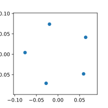
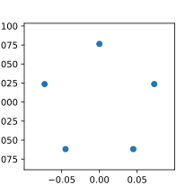
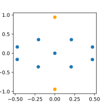

# Equidistant

A program that finds equidistant points. Given the number of points and the number of dimensions, the program tries to find a configuration of points that equalizes all distances between them. This constraint is specified as a loss function and optimized using PyTorch. I like the engineering simplicity.

```python
    model = gc.GeometricConstraints(points=3, dimensions=2, constraints=[
        lambda points, distances: distances.var()
    ])

    plt.scatter(*model.points().T)
```

<p align="center">
    
</p>

According to the internet, full equidistance can only be achieved if num_points <= num_dimensions + 1. The more interesting results are when we go past this constraint.

```python
model = gc.GeometricConstraints(points=5, dimensions=2, iterations=10000, constraints=[
    lambda points, distances: distances.var() + 1e-6 * (1 / distances**2).sum()
])

points = model.points()
points -= points.mean(axis=0)
plt.scatter(*points.T);
```

<p align="center">
    
</p>

Here we've mean-centered the points and added an anti-singularity constraint `1e-6 * (1 / distances**2).sum()`. This keeps the points from collapsing into each other, which is something that starts happening with larger numbers of particles. This is partly because we're constraining the distances by their variance and not a specific number.

We can constrain nice symmetries directly:

```python
model = gc.GeometricConstraints(points=5, dimensions=2, iterations=10000, constraints=[
    lambda points, distances: distances.var() + 1e-6 * (1 / distances**2).sum(),
    lambda points, distances: points[:2, 1].var()
])
```

<p align="center">
    
</p>

The second constraint wants two points to have the same y value, which gives the figure a left-right symmetry. Sometimes the figures fall into different minima:

<p align="center">
    
</p>

Points can be explicitly constrained.

```python
model = gc.GeometricConstraints(points=11, dimensions=2, iterations=10000, constraints=[
    lambda points, distances: distances.var() + 1e-6 * (1 / distances**2).sum(),
    lambda points, distances: ((points[:2] - torch.tensor([[0, -1], [0, 1]]))**2).sum()
])

points = model.points()
plt.scatter(*points[:2].T)
plt.scatter(*points[2:].T);
```

<p align="center">
    
</p>

This could be done by hard coding the points, but specifying them as constraints works well, and the weight on the constraint can always be increased to make it resemble a hard coded value.

It's fun to pin different locations to see what the system does:

```python
model = gc.GeometricConstraints(points=11, dimensions=2, iterations=10000, constraints=[
    lambda points, distances: distances.var() + 1e-6 * (1 / distances**2).sum(),
    lambda points, distances: ((points[:4] - torch.tensor([[-1, 0], [1, 0], [0, -1], [0, -2]]))**2).sum()
])

points = model.points()
plt.scatter(*points[:4].T, color='orange');
plt.scatter(*points[4:].T);
```

<p align="center">
    
</p>

```python
triangle = torch.tensor([[np.sqrt(3), -1], [-np.sqrt(3), -1], [0, 8]])
model = gc.GeometricConstraints(points=41, dimensions=2, iterations=40000, constraints=[
    lambda points, distances: distances.var() + 1e-6 * (1 / distances**2).sum(),
    lambda points, distances: ((points[:3] - triangle)**2).sum()
])

points = model.points()
plt.scatter(*points[:3].T, s=20, color='orange');
plt.scatter(*points[3:].T, s=20);
```

<p align="center">
    
</p>

Since the system isn't able to fully satisfy the equidistance constraint with a larger number of particles, we can look at some of the tradeoffs it makes by plotting the pairwise distances alongside the configurations:

<p align="center">
    
</p>